# Architecture Documentation

**Project:** quant-engine
**Repository:** `aoimasu/quant-engine` (from `Cargo.toml` `workspace.package.repository`)
**Generated:** 2026-07-18 (refreshed for the QE-430..454 GP-indicator-evolution program; original 2026-07-05)
**Scope:** Whole repository — the Rust Cargo workspace (`crates/*`), the admin server (`qe-server`), and the React admin SPA (`web/`).

A deterministic, deployment-agnostic quant engine. Two decoupled pipelines — **training** (search → ensemble → validation → G1 gate → sealed *vintage*) and **runtime** (bootstrap → live/paper evaluation → risk → venue) — share one domain vocabulary. An **admin UI** (`qe-server` + React SPA) is a *second composition root* that triggers and supervises the training-side CLI jobs and serves an authenticated browser app. A newer, **offline default-off GP indicator-evolution subsystem** (`qe evolve` → a sealed `qe-formula-pool` artefact) sits alongside training, governed by an **RBAC + audit-log + server-authoritative `seal_allowed`** production-seal path. All state is paper/offline; there is no live order submission wired in this repository, and the live evolve→production-seal path is currently **fail-closed by design** (§15).

> **Diagram sources:** every diagram below is editable. The `.drawio` files under `diagrams/` open in [diagrams.net](https://app.diagrams.net) and are the source of truth; the `.svg` files are the rendered exports embedded here and in `index.html`.
>
> **Tooling note:** the native draw.io export CLI / `drawio-skill` was **not available** in the generation environment. Diagrams were therefore authored directly as valid mxGraph XML (`.drawio`) with matching hand-rendered SVGs, both produced from one shared spec. They are genuine editable draw.io files, not screenshots.

---

## 1. Architecture Summary

quant-engine is a **Rust Cargo workspace** of 26 internal crates plus a **Vite + React 19 + TypeScript** admin SPA. The deterministic work runs as CLI jobs (`qe-cli`); a small `axum` server (`qe-server`) wraps those jobs behind an authenticated HTTP API and hosts the SPA.

| Area | Detected technology | Evidence | Confidence |
|---|---|---|---|
| Language (engine) | Rust 2021, edition pinned `1.96` | `Cargo.toml`, `rust-toolchain.toml` | High |
| Workspace | Cargo workspace, `crates/*` (26 crates) | `Cargo.toml` `members = ["crates/*"]` | High |
| CLI | `qe-cli` (binary `qe`): `train` / `backtest` / `ingest` / `evolve` | `crates/cli/src/main.rs`, `README.md` | High |
| GP indicator evolution | Offline, default-off symbolic-regression stage (`qe evolve`) → sealed `qe-formula-pool` | `crates/wfo/src/gp/*`, `crates/formula-pool`, `crates/run-protocol` | High |
| Pool governance / ops-safety | Per-request RBAC (`require_role`) + hash-chained+HMAC audit log + server-authoritative `seal_allowed` | `crates/server/src/{auth/mod,audit,pool_seal,pools}.rs` | High |
| Web/API server | `axum` 0.8 + `tokio` (multi-thread) | `Cargo.toml`, `crates/server/src/lib.rs` | High |
| Static hosting | `tower-http` `ServeDir`/`ServeFile` | `crates/server/src/lib.rs` | High |
| Frontend | React 19 + TypeScript 5.7, Vite 6 | `web/package.json`, `web/vite.config.ts` | High |
| Frontend state/routing | React hooks only — **no** router/redux/zustand | `web/src/app/App.tsx`; `web/package.json` (no such deps) | High |
| Persistence | Embedded LMDB (`heed` 0.20) — market + synthetic stores | `crates/storage/src/store.rs`, `Cargo.toml` | High |
| Artefact store | Content-addressed *vintage* JSON files | `crates/vintage/src/lib.rs` | High |
| Run store | File-based (`meta.json`/`index.json`/`result.json`) | `crates/server/src/runs/store.rs` | High |
| Authentication | Google OAuth (auth-code) + email allowlist + HMAC session cookie | `crates/server/src/auth/mod.rs`, `auth/session.rs` | High |
| Determinism | ChaCha8 RNG, content-hash lineage | `crates/determinism/*`, `Cargo.toml` | High |
| Deployment | Multi-stage `Dockerfile`, 12-factor env config | `Dockerfile`, `config.example.toml`, `README.md` | High |
| CI | GitHub Actions: `ci.yml` (Rust), `frontend.yml` (web) | `.github/workflows/*` | High |
| Observability | `tracing` structured logs; `/api/health` | `crates/telemetry/src/lib.rs`, `crates/server/src/lib.rs` | High |
| Live venue integration | Behind default-off `http` feature; **not** on server path | `crates/venue`, `crates/cli/src/main.rs` (ingest error) | High |
| Background queue / cron | Not detected — run supervision is a bounded worker pool | `crates/server/src/runs/manager.rs` | High |

---

## 2. System Context

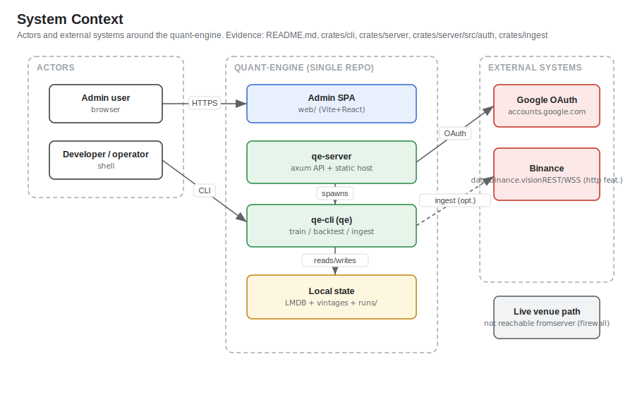
*Editable source: [`diagrams/01-system-context.drawio`](./diagrams/01-system-context.drawio)*

Two human actors interact with the system:

- **Admin user** — signs in through the browser SPA (Google OAuth, allowlisted email) to trigger, monitor, and review runs.
- **Developer / operator** — runs the `qe-cli` (`qe`) binary directly (train / backtest / ingest).

External systems, both used only through explicit seams:

- **Google OAuth** (`accounts.google.com`, `oauth2.googleapis.com`) — identity for the admin UI. Evidence: `crates/server/src/auth/mod.rs`.
- **Binance** (`data.binance.vision` bulk history; REST/WSS) — market-data ingestion and (runtime-side) venue connectivity, both **behind the default-off `http` feature**; the committed sample store lets backtests run fully offline. Evidence: `crates/ingest`, `crates/venue`, `crates/cli/src/main.rs`.

The **live venue/trading path is not reachable from the server** — the QE-132 firewall forbids `qe-server` from linking `qe-runtime`/`qe-venue` (§14).

---

## 3. High-Level Application Architecture

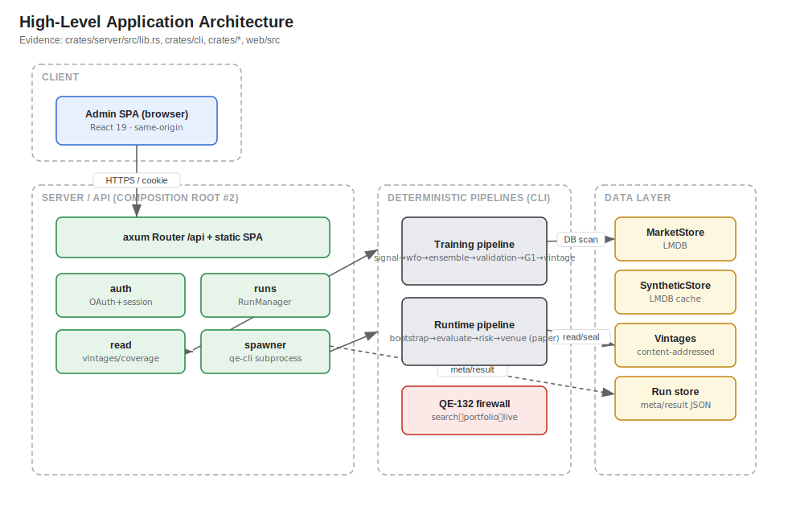
*Editable source: [`diagrams/02-high-level-architecture.drawio`](./diagrams/02-high-level-architecture.drawio)*

The system has **two composition roots** that share the foundation crates but never the live path:

1. **`qe-cli`** — the deterministic pipeline as three jobs, each emitting JSON-line progress on stdout. Evidence: `crates/cli/src/main.rs`.
2. **`qe-server`** — an `axum` HTTP server that serves the SPA at `/`, exposes `/api`, and spawns `qe-cli` subprocesses to run jobs. Async lives **only** here. Evidence: `crates/server/src/lib.rs`.

The **data layer** is local and file/LMDB-based: `MarketStore` + `SyntheticStore` (LMDB), content-addressed *vintages*, and a file-based run store. The **QE-132 firewall** enforces a three-way `search ⟂ portfolio ⟂ live` separation (§14).

---

## 4. Repository and Module Structure

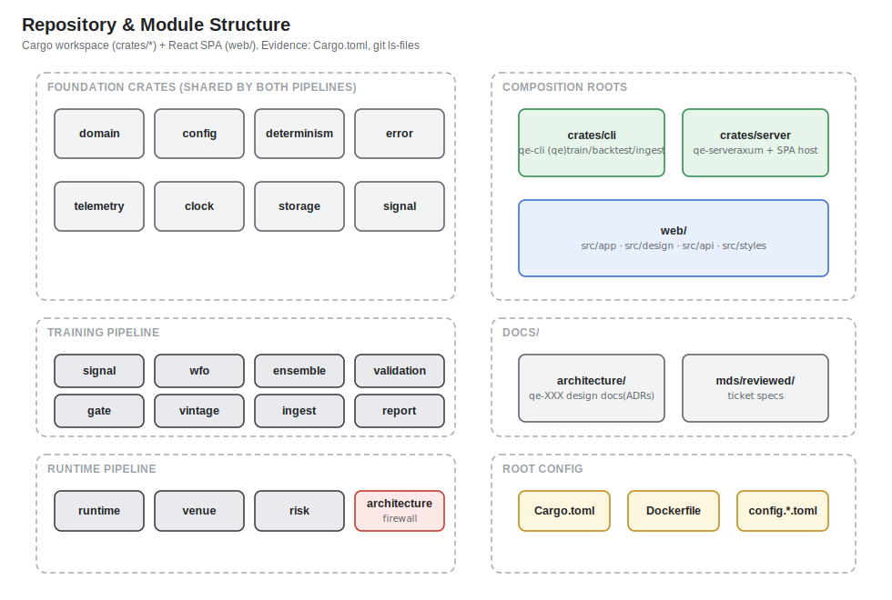
*Editable source: [`diagrams/03-repository-structure.drawio`](./diagrams/03-repository-structure.drawio)*

| Path | Responsibility | Important files | Notes |
|---|---|---|---|
| `crates/domain` | Shared vocabulary (instruments, time, money, bars, side, vintage hash) | `src/{money,bar,instrument,time}.rs` | Exact fixed-point money, never float |
| `crates/config` | Typed, layered, reproducible config (TOML → profile → `QE_` env) | `src/{schema,universe}.rs` | `content_hash` feeds vintage lineage |
| `crates/determinism` | RNG, reproduction harness, lineage | `src/{rng,harness,lineage}.rs` | ChaCha8 portable streams |
| `crates/error` | Error taxonomy + hot-path panic-freedom lint | `src/lib.rs`, `tests/hot_path_lint.rs` | `ErrorClass`/`Disposition` |
| `crates/telemetry` | Structured `tracing` + correlation fields | `src/lib.rs` | `HOT_PATH_TARGET` |
| `crates/clock` | Clock-skew / time-sync guard | `src/skew.rs` | Halts on excess skew |
| `crates/storage` | Embedded LMDB market + synthetic stores | `src/{store,synthetic,key,coverage}.rs` | Versioned schema |
| `crates/signal` | Indicators, features, genome, regime (train+runtime shared) | `src/{genome,feature,indicator/*}.rs`, `src/indicator/expr.rs` | `Genome::decide` shared logic; `expr.rs` = the Expr/Kernel FIR-tree indicator the GP engine evolves |
| `crates/wfo` | Walk-forward / MAP-Elites search, backtest realism, **and the GP engine (`src/gp/`)** | `src/{mapelites,walkforward,fitness,cv,friction}.rs`, `src/gp/{mod,archive,deflation,descriptor,freeze,gates,variation}.rs` | Search side of firewall; `gp/` = Expr/Kernel FIR tree interpreter, `Elite<ExprTree>` MAP-Elites archive, GP-aware deflation + tradability gates + K≤16 freeze |
| `crates/ensemble` | Discrete-DE ensemble, stress, capacity | `src/{de,objective,stress,capacity}.rs` | Portfolio side of firewall |
| `crates/formula-pool` | Frozen-pool artefact leaf: K≤16 canonical S-exprs + deflation summary + review lineage | `src/{lib,lifecycle,governance_record}.rs` | Separate directory root; reuses Vintage seal/verify/load SHA-256 discipline; **runtime never loads a pool** |
| `crates/run-protocol` | Leaf carrying the run-spec + progress protocol | `src/lib.rs` (`EvolveParams`, `EvolveMode`, `ProgressLine`, `PROTOCOL_VERSION`) | Shared CLI↔server contract for `evolve` runs |
| `crates/validation` | DSR / PBO / SPA / null benchmarks | `src/{dsr,pbo,spa,nulls}.rs` | Data-snooping suite |
| `crates/gate` | G1 holdout-embargo over-fit gate | `src/lib.rs` | `evaluate_g1` |
| `crates/vintage` | Sealed vintage artefact format | `src/lib.rs` | Content-hash pinned |
| `crates/report` | Per-vintage validation evidence pack | `src/lib.rs` | Markdown render |
| `crates/ingest` | Binance bulk-history download + fusion | `src/{downloader,fetcher,fuse,integrity}.rs` | `http` feature |
| `crates/runtime` | Live/paper evaluation, bootstrap, hedging | `src/{evaluator,bootstrap,cutover,pretrade}.rs` | Runtime side (firewalled from server) |
| `crates/venue` | Venue REST/WSS/user-data adapters | `src/{rest,ws,stream,userdata}.rs` | `http` feature |
| `crates/risk` | Risk-limit + kill-switch contract | `src/{limit,kill,gate,breaker}.rs` | Shared order-gate vocabulary |
| `crates/architecture` | Executable firewall/decoupling guard | `src/lib.rs`, `tests/firewall.rs` | CI-enforced |
| `crates/cli` | Composition root #1: `qe` binary | `src/main.rs`, `src/jobs/*` | train/backtest/ingest |
| `crates/server` | Composition root #2: admin API + SPA host | `src/{lib,main}.rs`, `src/{auth,runs,read}` | axum + tokio |
| `web/` | React admin SPA | `src/{app,design,api,styles}` | Vite build → `web/dist` |
| `docs/architecture` | Design ADRs (`qe-XXX-*.md`) + this package | `qe-001…qe-268`, `qe-450-gp-indicator-evolution-design.md` | Evidence trail; QE-450 is the GP design of record |
| `docs/mds/reviewed` | Per-ticket reviewed specs | `qe-*.md` (incl. `qe-451..454-*`) | Authoritative "what shipped + verified" |

Root files: `Cargo.toml` / `Cargo.lock` (workspace), `Dockerfile`, `config.example.toml`, `deny.toml` (`cargo-deny`), `clippy.toml`, `rust-toolchain.toml`.

---

## 5. Frontend Architecture

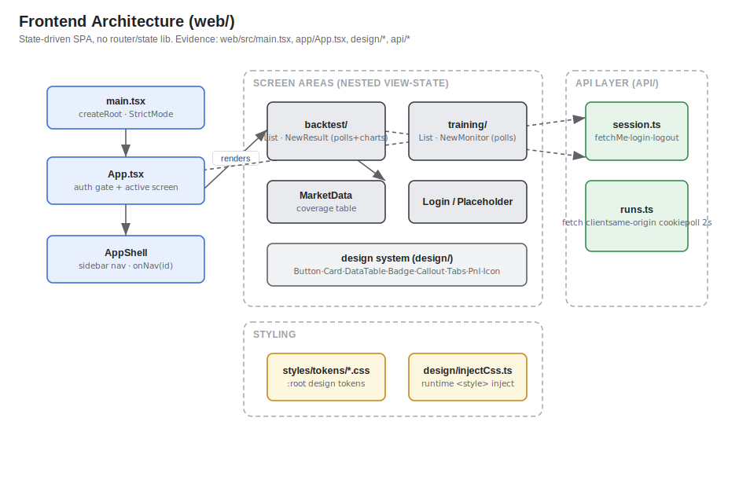
*Editable source: [`diagrams/04-frontend-architecture.drawio`](./diagrams/04-frontend-architecture.drawio)*

The SPA is **state-driven with no router and no state library** — confirmed absent from `web/package.json` (no `react-router`, redux, zustand, jotai) and no `createContext` in `web/src`. Navigation is a two-level `useState` machine.

- **Entry** — `web/src/main.tsx` mounts `<App/>` in `StrictMode` via `createRoot`; imports `./styles/fonts` and `./styles/global.css`. `web/index.html` sets `data-theme="dark"` and `#root`.
- **App shell / navigation** — `web/src/app/App.tsx` holds an auth `status` (`loading | unauth | auth`, driven by `fetchMe()`) and an `active` screen id. `web/src/design/AppShell.tsx` renders the sidebar; `onNav(id)` switches screens. A one-shot `backtestVintage` deep-link lets the training monitor push a sealed vintage into the New-backtest flow.
- **Screen areas** (each a nested view-state machine): `backtest/` (`BacktestsList`, `NewBacktest`, `BacktestResult`), `training/` (`TrainingList`, `NewTraining`, `TrainingMonitor`), the newer `evolve/` (`EvolveArea`, `CampaignList`, `NewCampaign`, `CampaignMonitor`, `FormulaSexpr`, `PoolReview`, `PoolBrowser`) mirroring `training/`, plus `MarketData`, `Login`, and `Placeholder` (used for the not-yet-built Strategies screen).
- **`evolve/` area** — `web/src/app/evolve/` launches and monitors GP campaigns (`NewCampaign` → `CampaignMonitor`, `FormulaSexpr` rendering evolved S-expressions) and drives the pool-governance gate (`PoolReview`, `PoolBrowser`). It honestly surfaces the server's fail-closed reality: a production seal is refused (409 + named blockers), never faked. Evidence: `web/src/app/evolve/*`.
- **Design system** — `web/src/design/index.ts` exports primitives: `Button`, `Card`, `Badge`, `Callout`, `Input`, `Select`, `DataTable`, `Tag`, `Pnl`, `Tabs`, `Icon` (icons from `lucide-react`), `AppShell`. Styling uses `:root` CSS custom-property **design tokens** (`web/src/styles/tokens/*.css`) plus a runtime `injectCss()` (`web/src/design/injectCss.ts`) so ported class rules render identically in the built app and in jsdom tests.
- **API layer** — `web/src/api/session.ts` (`fetchMe`, `startLogin`, `logout`, `detectRejection`) and `web/src/api/runs.ts` (typed `fetch` client, `credentials: 'same-origin'`). Both monitor screens **poll `GET /api/runs/:id` every 2000 ms** with bounded retry (`MAX_POLL_FAILURES = 4`), stopping on a terminal status.

---

## 6. Backend/API Architecture

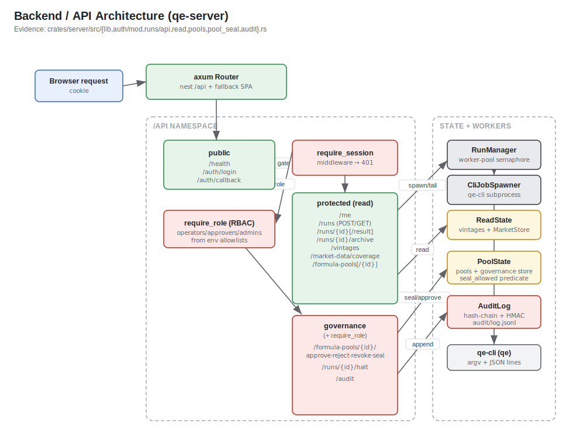
*Editable source: [`diagrams/05-backend-api-architecture.drawio`](./diagrams/05-backend-api-architecture.drawio)*

`qe-server` builds one `axum::Router` (`build_router`, `crates/server/src/lib.rs`): `/api` is a nested sub-router carrying a shared `AppState { manager, auth, read }`; everything else is served from the static SPA dir with a client-side-routing fallback to `index.html`. Session auth (`require_session`) is layered over the **protected** subtree only; `/api/health` and `/api/auth/*` stay public.

| Method | Route | Handler / source | Auth required | Main service | Notes |
|---|---|---|---|---|---|
| GET | `/api/health` | `health` — `lib.rs` | No | — | `{"status":"ok"}` |
| GET | `/api/auth/login` | `login` — `auth/mod.rs` | No | `AuthContext` | Mints CSRF state, 302 → Google |
| GET | `/api/auth/callback` | `callback` — `auth/mod.rs` | No | `AuthContext` | Verifies token, sets session cookie |
| GET | `/api/me` | `me` — `auth/mod.rs` | Yes | — | `{email}` |
| POST | `/api/runs` | `create_run` — `runs/api.rs` | Yes | `RunManager` | `201 {id}` / `400` on validation |
| GET | `/api/runs` | `list_runs` — `runs/api.rs` | Yes | `RunManager` | Newest-first `RunMeta[]` |
| GET | `/api/runs/{id}` | `get_run` — `runs/api.rs` | Yes | `RunManager` | `RunMeta` / `404` |
| GET | `/api/runs/{id}/result` | `get_result` — `runs/api.rs` | Yes | `RunManager` | `result.json` / `409` if not ready |
| GET | `/api/vintages` | `list_vintages` — `read.rs` | Yes | `ReadState` | Sealed-vintage list (hash-verified) |
| GET | `/api/market-data/coverage` | `market_data_coverage` — `read.rs` | Yes | `ReadState` | LMDB coverage rows |
| GET | `/api/formula-pools` | `list_pools` — `pools.rs` | Yes (session) | `PoolState` | Sealed formula-pool list (hash-verified) |
| GET | `/api/formula-pools/{id}` | `get_pool` — `pools.rs` | Yes (session) | `PoolState` | One pool / `404` |
| GET | `/api/runs/{id}/archive` | `get_archive` — `pools.rs` | Yes (session) | `PoolState` | Evolve MAP-Elites archive (`EvolveArchive`) |
| POST | `/api/formula-pools/{id}/approve` | `approve` — `pools.rs` | Yes + `require_role(Approver)` | `PoolState` | Dual sign-off step (two distinct approvers ≠ launcher) |
| POST | `/api/formula-pools/{id}/reject` | `reject` — `pools.rs` | Yes + `require_role(Approver)` | `PoolState` | Guarded lifecycle transition |
| POST | `/api/formula-pools/{id}/revoke` | `revoke` — `pools.rs` | Yes + `require_role(Approver)` | `PoolState` | Post-seal revocation |
| POST | `/api/formula-pools/{id}/seal` | `seal` — `pools.rs` | Yes + `require_role(Approver)` | `PoolState` + `seal_allowed` | Production seal; `409` + named blockers if the predicate fails |
| POST | `/api/runs/{id}/halt` | `halt` — `pools.rs` | Yes + `require_role(Operator)` | `RunManager` | Authz'd run halt (reuses the abort→kill path) |
| GET | `/api/audit` | `get_audit` — `audit.rs` | Yes + `require_role(Operator)` | `AuditLog` | Replays + verifies the hash-chain; fail-closed if key unset |

Handlers extract sub-state (`Arc<RunManager>`, `Arc<AuthContext>`, `Arc<ReadState>`, `PoolState`, `RoleConfig`) projected from `AppState` via `FromRef`. Unknown `/api/*` paths return a reserved-namespace `404` (never the SPA shell). Blocking work (LMDB scans, vintage/pool load, token verify) runs inside `tokio::task::spawn_blocking`.

All the routes above are session-gated by `require_session` (the `protected_routes` subtree). The **governance** routes (`approve`/`reject`/`revoke`/`seal`, `runs/{id}/halt`, `audit`) are **additionally** behind a per-request `require_role` seam that resolves the caller's role from env allowlists — the read routes need only a valid session. Evidence: `crates/server/src/{lib,pools,audit}.rs`, `crates/server/src/auth/mod.rs` (`require_role`).

---

## 7. Authentication and Authorization Flow

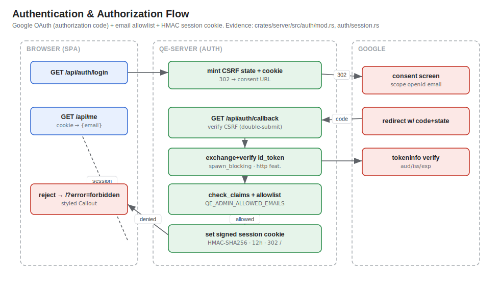
*Editable source: [`diagrams/06-auth-flow.drawio`](./diagrams/06-auth-flow.drawio)*

Google OAuth **authorization-code** flow with an **email allowlist** and an **HMAC-SHA256 signed session cookie**. Evidence: `crates/server/src/auth/mod.rs`, `crates/server/src/auth/session.rs`.

1. **`GET /api/auth/login`** — mint a CSRF `state` (UUID v4), set it in a short-lived `HttpOnly; Secure; SameSite=Lax` cookie, and `302` to Google's consent screen with `scope=openid email`.
2. **`GET /api/auth/callback`** — verify the `state` (double-submit against the cookie), then exchange + verify the ID token via the injectable `IdTokenVerifier` (real Google verifier behind the `http` feature; a mock in tests) inside `spawn_blocking`.
3. **Policy check** — `check_claims` enforces `aud` = our client id, a Google `iss`, unexpired `exp`, and `email_verified`.
4. **Allowlist** — `AuthConfig::is_allowed` (from `QE_ADMIN_ALLOWED_EMAILS`, trimmed/lowercased, **fail-closed** when empty). A genuine but non-allowlisted login is redirected to `/?error=forbidden` (styled rejection UI), no cookie set.
5. **Session** — `mint_session_cookie` signs `{email, exp}` (default 12 h TTL) as `HttpOnly; Secure; SameSite=Lax`. `require_session` middleware verifies it (constant-time) on every protected route and injects the email; failure → `401`.

A missing `QE_SESSION_SECRET` falls back to a **random ephemeral** secret (sessions don't survive a restart) so the server still boots — a fail-closed default.

**RBAC / separation of duties (QE-452/454).** On top of the session gate, the governance routes enforce per-request role-based access control. `require_role` (`crates/server/src/auth/mod.rs`) resolves the session-derived email against three env allowlists — `QE_ROLE_OPERATORS`, `QE_ROLE_APPROVERS`, `QE_ROLE_ADMINS` — that are **never** carried in the cookie or request body, so a role cannot be self-asserted by a client. The production seal path requires **dual sign-off**: two *distinct* approvers, each different from the launcher. Whether a pool may seal is decided by the server-authoritative `seal_allowed` predicate (§14), not by the caller. Evidence: `crates/server/src/auth/mod.rs`, `crates/server/src/pool_seal.rs`, `crates/formula-pool/src/governance_record.rs`.

---

## 8. Core Runtime Request Flow

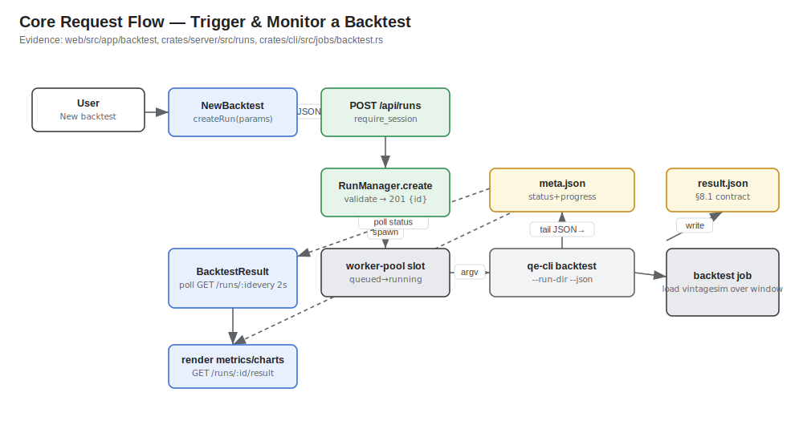
*Editable source: [`diagrams/07-core-request-flow.drawio`](./diagrams/07-core-request-flow.drawio)*

Core user action: **trigger and monitor a backtest** (`web/src/app/backtest`, `crates/server/src/runs`, `crates/cli/src/jobs/backtest.rs`).

1. In the SPA, `NewBacktest` calls `createRun(params)` → `POST /api/runs` (`{type:"backtest", params}`), session-gated.
2. `RunManager::create` validates leniently-parsed params (uniform `400` on any missing/invalid field), writes the initial `meta.json`, and returns `201 {id}`.
3. The run enters the bounded worker pool: `queued → running` when a slot frees. `CliJobSpawner` spawns `qe-cli backtest … --run-dir <dir> --json` with stdout/stderr piped and `kill_on_drop`.
4. The supervisor tails the child's JSON-line progress and **atomically** updates `meta.json`; the child writes `result.json` (the §8.1 contract) on success.
5. `BacktestResult` **polls `GET /api/runs/:id` every 2 s**; on `succeeded` it fetches `GET /api/runs/:id/result` once and renders metrics, inline-SVG equity/drawdown charts, a monthly-returns heatmap, and a trades table. On failure it surfaces the captured error tail. `409` is returned if the result isn't ready.

**The `evolve` flow — a second, parallel lifecycle.** The GP campaign (`type:"evolve"`) reuses the same create→supervise→poll machinery but produces a *pool*, not a vintage, and adds a **two-lifecycle model**. An **ephemeral evolve RUN** (illuminate → GP-aware deflation/gates → K≤16 freeze) seals a `qe-formula-pool` artefact; the terminal `done` line emits `pool:` and **never `vintage:`** (a sealed pool never auto-mints a vintage). That pool then has its own **durable POOL lifecycle** — `Draft → Approved → Sealed` (+ `Rejected`/`Revoked`) — persisted under `<data_dir>/governance`, *not* in the run. Guarded transitions reject every illegal edge; the production `seal` step is gated by `require_role(Approver)`, dual sign-off, and the `seal_allowed` predicate (§14). Evidence: `crates/formula-pool/src/lifecycle.rs`, `crates/server/src/pools.rs`, `crates/run-protocol/src/lib.rs`.

---

## 9. Data Model

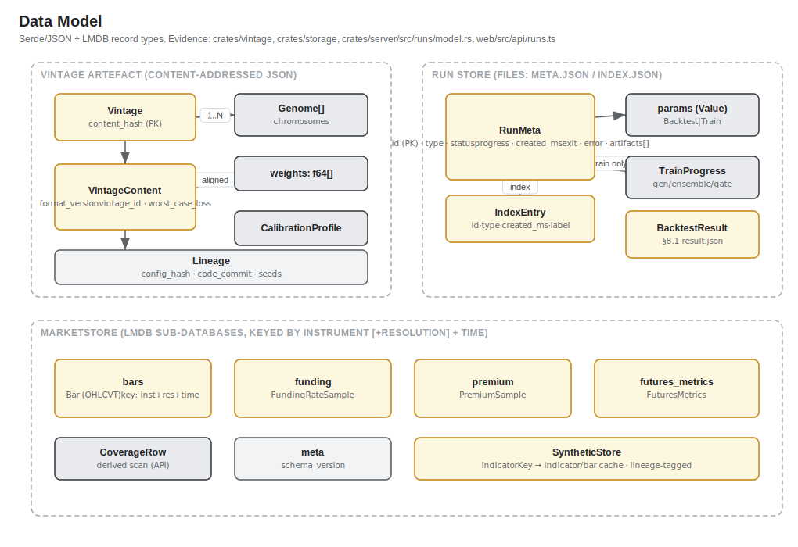
*Editable source: [`diagrams/08-data-model.drawio`](./diagrams/08-data-model.drawio)*

There is **no relational database**. Data lives in three shapes: content-addressed **vintage artefacts** (JSON), a file-based **run store**, and embedded **LMDB** stores. All types below come from actual serde/struct definitions.

**Vintage artefact** — `crates/vintage/src/lib.rs`:
- `Vintage { content: VintageContent, content_hash }` — `content_hash` is a SHA-256 over the canonical JSON of the content (the identity/PK).
- `VintageContent { format_version (=2), vintage_id, chromosomes: Vec<Genome>, weights: Vec<f64>, calibration: CalibrationProfile, worst_case_loss: Option<f64>, lineage: Lineage }`. `weights` are aligned 1:1 with `chromosomes` (validated at seal time). `Lineage` = config hash + code commit + seeds.

**Run store** — `crates/server/src/runs/model.rs` (files: `meta.json`, `index.json`, `result.json`, `stdout.log`):
- `RunMeta { id (PK), type, status (queued|running|succeeded|failed), params: Value, progress, train?: TrainProgress, created_ms, started_ms?, finished_ms?, exit?, error?, artifacts[] }`.
- `params` is stored opaquely (typed as `BacktestParams` or `TrainParams` at create time). `TrainProgress` carries the latest `GenSnapshot` / `EnsembleSnapshot` / `GateSnapshot` + sealed `vintage` id.
- `IndexEntry { id, type, created_ms, label }` — immutable discovery/order fields only (never duplicates status).
- `BacktestResult` (`web/src/api/runs.ts`, §8.1) — strategy, window, universe, costs, metrics, `equity_curve[]`, `drawdown[]`, `monthly_returns[]`, `trades[]`.

**LMDB `MarketStore`** — `crates/storage/src/store.rs`, sub-databases keyed by instrument (+ resolution for bars) + time, order-preserving for chronological range scans:
- `bars` → `Bar` (OHLCVT), `funding` → `FundingRateSample`, `premium` → `PremiumSample`, `futures_metrics` → `FuturesMetrics`, `meta` → schema version.
- `CoverageRow` (`{symbol, resolution, from, to, bars}`) is derived by a read-only scan for the API.
- `SyntheticStore` — derived indicator-state / multi-resolution cache keyed by `IndicatorKey`, lineage-tagged so stale entries are evictable.

---

## 10. Environment Configuration Matrix

Values are placeholders only — **no real secrets are read or shown**. Engine config comes from `config.example.toml` / `config.toml` (every key overridable by a `QE_`-prefixed, `__`-nested env var); server/auth knobs come from env directly (`crates/server/src/lib.rs`, `crates/server/src/auth/mod.rs`).

| Variable | Purpose | Local | Staging | Production | Required | Evidence |
|---|---|---|---|---|---|---|
| `QE_CONFIG` | Config file path (CLI backtest) | set / default `config.toml` | configured | configured | optional | `crates/cli/src/main.rs` |
| `QE_DETERMINISM__SEED` | Master RNG seed override | example only | example only | example only | optional | `config.example.toml`, `README.md` |
| `QE_STORAGE__MARKET_DIR` | LMDB market dir | default `data/lmdb/market` | volume path | volume path | optional | `crates/config/src/schema.rs` |
| `QE_STORAGE__SYNTHETIC_DIR` | LMDB synthetic cache dir | default | volume path | volume path | optional | `crates/config/src/schema.rs` |
| `QE_STORAGE__ARTIFACTS_DIR` | Vintage artefacts dir | default `data/artifacts` | volume path | volume path | optional | `crates/config/src/schema.rs` |
| `QE_CODE_COMMIT` | Code provenance in vintage id | falls back to crate version | build SHA | build SHA | optional | `crates/cli/src/main.rs` |
| `QE_SERVER_ADDR` | Server bind address | default `127.0.0.1:8080` | configured | configured | optional | `crates/server/src/lib.rs` |
| `QE_SERVER_STATIC_DIR` | Built SPA dir served at `/` | `web/dist` | configured | configured | optional (needed for SPA) | `crates/server/src/lib.rs`, `README.md` |
| `QE_SERVER_DATA_DIR` | State dir (holds `runs/`) | default `data` | volume path | volume path | optional | `crates/server/src/lib.rs` |
| `QE_SERVER_MAX_CONCURRENCY` | Max concurrent run subprocesses | default `2` | configured | configured | optional | `crates/server/src/lib.rs` |
| `QE_CONFIG` | qe-config file the server loads for shared `[storage]` dirs + pins onto the spawned CLI (QE-419) | default `config.toml` | configured | configured | optional | `crates/server/src/config.rs`, `crates/cli/src/main.rs` |
| `QE_SERVER_ARTIFACTS_DIR` | **Deprecated (QE-419)** — use `[storage].artifacts_dir` / `QE_STORAGE__ARTIFACTS_DIR`; a value diverging from qe-config now refuses boot | from qe-config | from qe-config | from qe-config | deprecated | `crates/server/src/config.rs` |
| `QE_SERVER_MARKET_DIR` | **Deprecated (QE-419)** — use `[storage].market_dir` / `QE_STORAGE__MARKET_DIR`; a value diverging from qe-config now refuses boot | from qe-config | from qe-config | from qe-config | deprecated | `crates/server/src/config.rs` |
| `QE_SERVER_CLI_BIN` | Path to `qe-cli` binary to spawn | co-located `qe` | configured | configured | optional | `crates/server/src/runs/spawn.rs` |
| `QE_GOOGLE_CLIENT_ID` / `QE_OAUTH_GOOGLE_CLIENT_ID` | OAuth client id (= token `aud`) | configured in env | configured | configured | required for login | `crates/server/src/auth/mod.rs` |
| `QE_GOOGLE_CLIENT_SECRET` / `QE_OAUTH_GOOGLE_CLIENT_SECRET` | OAuth client secret | secret, value omitted | secret, omitted | secret, omitted | required for login | `crates/server/src/auth/mod.rs` |
| `QE_GOOGLE_REDIRECT_URI` / `QE_OAUTH_REDIRECT_URI` | Registered callback URI | configured | configured | configured | required for login | `crates/server/src/auth/mod.rs` |
| `QE_SESSION_SECRET` | HMAC session-signing key | secret, omitted (random fallback) | secret, omitted | **secret, required** | recommended (prod) | `crates/server/src/auth/mod.rs` |
| `QE_ADMIN_ALLOWED_EMAILS` | Comma-separated allowlist | configured | configured | configured | required (fail-closed) | `crates/server/src/auth/mod.rs` |
| `QE_ROLE_OPERATORS` | Comma-separated email allowlist for the Operator role (halt / audit read) | configured | configured | configured | required for governance ops | `crates/server/src/auth/mod.rs` |
| `QE_ROLE_APPROVERS` | Email allowlist for the Approver role (approve/reject/revoke/seal) | configured | configured | configured | required for governance ops | `crates/server/src/auth/mod.rs` |
| `QE_ROLE_ADMINS` | Email allowlist for the Admin role | configured | configured | configured | optional | `crates/server/src/auth/mod.rs` |
| `QE_AUDIT_SIGNING_KEY` | HMAC key for the tamper-evident audit log | secret, omitted | secret, omitted | **secret, required** | required (fail-closed if unset) | `crates/server/src/audit.rs` |
| `QE_SERVER_MAX_EVOLVE_CONCURRENCY` | Evolve-run semaphore (serialises campaigns; default `1`) | default `1` | configured | configured | optional | `crates/server/src/{lib,runs/manager}.rs` |
| `QE_SERVER_MAX_RUN_SECS` | Per-run wall-clock deadline (default `86400` = ~24h) | default `86400` | configured | configured | optional | `crates/server/src/{lib,runs/manager}.rs` |

Staging/production **environment separation is not represented in the repository** — there are no per-environment config files or deploy manifests. Values above reflect how the single 12-factor config would be parameterised; treat the staging/production columns as `configured in environment`, not detected.

---

## 11. Deployment and Infrastructure

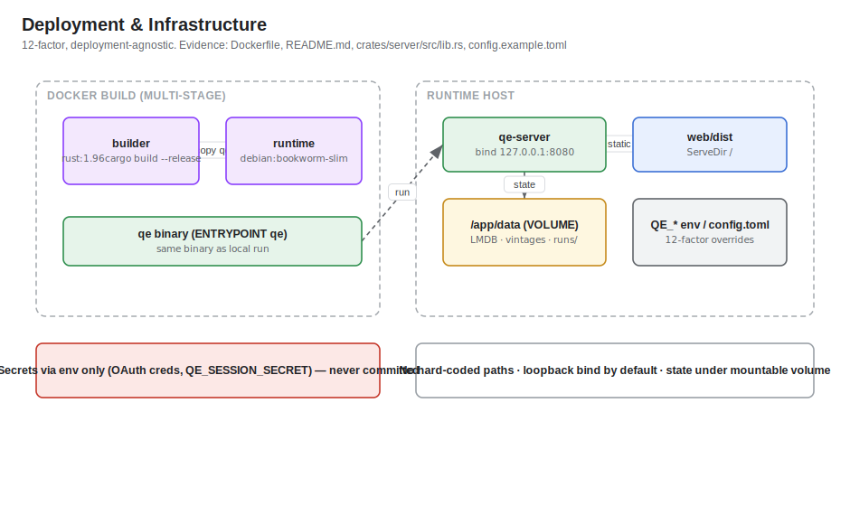
*Editable source: [`diagrams/09-deployment-infrastructure.drawio`](./diagrams/09-deployment-infrastructure.drawio)*

A single multi-stage `Dockerfile` (deployment-agnostic, 12-factor). Evidence: `Dockerfile`, `README.md`, `config.example.toml`.

- **Builder** — `rust:1.96`, `cargo build --release --locked -p qe-cli`.
- **Runtime** — `debian:bookworm-slim`; copies the `qe` binary; `ENTRYPOINT ["qe"]`, `CMD ["train", "--config", "config.toml"]`. Persistent state under `VOLUME ["/app/data"]`.
- **The container runs the same `qe` binary as the local CLI** — no platform-specific assumptions; all state paths are relative and mountable.
- **Server + SPA** — `README.md` documents building the SPA (`npm ci && npm run build` → `web/dist`) and running `qe-server` with `QE_SERVER_STATIC_DIR=web/dist`, serving `web/dist` at `/` and the API at `/api`. The server **binds loopback (`127.0.0.1:8080`) by default**.

No cloud infrastructure-as-code (Terraform / CDK / Pulumi / Kubernetes / Helm) and **no PaaS config files** (no `vercel.json` / `fly.toml` / `render.yaml`) were detected. The README notes moving to a platform such as Railway would be "mechanical" but that is aspirational, not configured — `Deployment target beyond Docker: not detected in repository`.

---

## 12. CI/CD and Observability

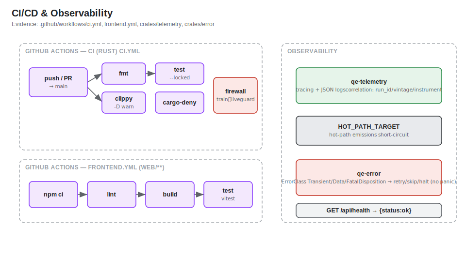
*Editable source: [`diagrams/10-cicd-observability.drawio`](./diagrams/10-cicd-observability.drawio)*

> **Program note (2026-07-18):** CI and `main` branch protection were **temporarily disabled** during the QE-430..454 run; re-enabling both is a recorded repo-admin follow-up (§15). The workflow files below are unchanged and describe the intended (and to-be-restored) pipeline. Evidence: `docs/current-state.html` (deferred follow-ups).

**CI** — GitHub Actions, on push to `main` and all PRs:

- `.github/workflows/ci.yml` (Rust): four jobs — `fmt` (`cargo fmt --all --check`), `clippy` (`--workspace --all-targets --locked -D warnings`), `test` (`cargo test --workspace --locked`, which also runs the `qe-architecture` **firewall** test and the `qe-error` hot-path clippy lint), and `deny` (`cargo-deny check`). Toolchain pinned to `1.96.0` by commit SHA for supply-chain determinism.
- `.github/workflows/frontend.yml` (web, path-filtered to `web/**`): `npm ci` → `npm run lint` → `npm run build` → `npm test` (vitest) on Node 20. Not a required check until an admin marks it so.

**No CD / deploy workflow was detected** — there is no publish, release, or environment-deploy job. `Continuous deployment: not detected in repository`.

**Observability** — `crates/telemetry/src/lib.rs`: structured `tracing` with JSON log format and correlation fields (`run_id`, `vintage_hash`, `instrument`, `window_id`); a `HOT_PATH_TARGET` whose emissions short-circuit under production filters. `crates/error` maps errors to a `Disposition` (retry / skip / halt — never panic). Liveness: `GET /api/health`. No external APM/error-tracking SaaS (Sentry, Datadog, OpenTelemetry exporter, etc.) was detected.

---

## 13. Background Jobs, Webhooks, and Async Events

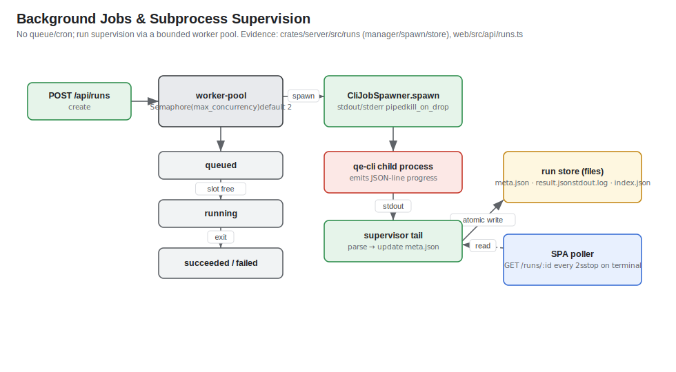
*Editable source: [`diagrams/11-background-jobs.drawio`](./diagrams/11-background-jobs.drawio)*

There is **no message queue, cron scheduler, or webhook handler**. Long-running work is handled by **in-process subprocess supervision** in `qe-server`. Evidence: `crates/server/src/runs/{manager,spawn,store}.rs`.

- **Worker pool** — a `tokio` semaphore bounds concurrently-running subprocesses (`QE_SERVER_MAX_CONCURRENCY`, default 2); excess runs stay `queued`.
- **`qe evolve` job + evolve supervision** — the GP campaign is a `type:"evolve"` run supervised like the others, with two extra controls (`crates/server/src/runs/manager.rs`): a **per-run wall-clock deadline** (default ~24h, `QE_SERVER_MAX_RUN_SECS`) enforced via `tokio::time::timeout` that reuses the existing abort → `kill_on_drop` path, and a **dedicated evolve semaphore** (`QE_SERVER_MAX_EVOLVE_CONCURRENCY`, default `1`) that serialises campaigns without starving backtests. An authz'd **`POST /api/runs/{id}/halt`** (`require_role(Operator)`) lets an operator abort a run early.
- **Spawn** — `CliJobSpawner` runs `qe-cli backtest`/`train … --run-dir <dir> --json` with stdout/stderr piped and `kill_on_drop` (a dropped supervisor reaps the child, so no runaway job leaks on shutdown).
- **Supervision** — the server tails the child's JSON-line progress and **atomically** updates `meta.json` (temp file + `rename`); on exit it records `succeeded`/`failed` with the exit code and an error tail. Artefacts (`result.json`, `stdout.log`) land in the run dir.
- **Client polling** — the SPA polls `GET /api/runs/:id` every 2 s and stops on a terminal status (there is no server push / websocket for progress).

Retry/dead-letter semantics: not applicable — a failed run is terminal and surfaced to the UI; there is no automatic re-queue.

---

## 14. Security Boundaries and Data Protection

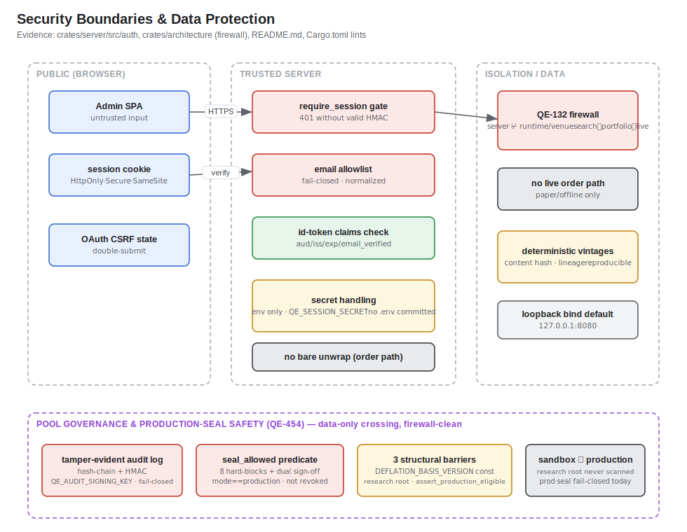
*Editable source: [`diagrams/12-security-boundaries.drawio`](./diagrams/12-security-boundaries.drawio)*

- **Public browser boundary** — untrusted SPA input; the session cookie is `HttpOnly; Secure; SameSite=Lax`; OAuth uses a **CSRF `state` double-submit** cookie. Evidence: `crates/server/src/auth/mod.rs`.
- **Server / API boundary** — `require_session` gates the whole protected `/api` subtree (`401` without a valid HMAC-signed session), verified constant-time. Unknown `/api/*` returns `404` (reserved namespace), never the SPA shell.
- **AuthZ** — an **email allowlist** (`QE_ADMIN_ALLOWED_EMAILS`), **fail-closed** (empty ⇒ nobody), plus strict ID-token claim checks (`aud`/`iss`/`exp`/`email_verified`).
- **Secret handling** — OAuth creds and `QE_SESSION_SECRET` come from the environment only; `README.md` and config keep no committed secrets; a missing session secret degrades to a random ephemeral key rather than a weak constant.
- **Architectural isolation (QE-132 firewall)** — `crates/architecture/tests/firewall.rs` builds the real crate-dependency graph and **fails CI** if a forbidden edge exists: `qe-wfo ⊬ {ensemble, runtime, venue}`, `qe-ensemble ⊬ {wfo, runtime, venue}`, and `qe-server ⊬ {runtime, venue}`. This encodes `search ⟂ portfolio ⟂ live` and guarantees the admin server can never link the live-trading path.
- **Pool governance is firewall-clean** — the GP subsystem respects the QE-132 firewall: the evolved formulas' deflation statistics cross into `seal_allowed` as plain **data** (no crate edge), and `qe-runtime`/`qe-venue` never depend on `qe-formula-pool` (the runtime never loads a pool). `qe-wfo/src/gp/` still cannot reach `runtime`/`venue`. Evidence: `crates/architecture/tests/firewall.rs`, `crates/formula-pool/Cargo.toml`.
- **Tamper-evident audit log (QE-454)** — `<data_dir>/audit/log.jsonl` (a sibling of `runs/`) is an append-only JSONL log where each entry is bound into a **hash chain** (`entry_hash = SHA256(canonical_json ‖ prev)`) **and** signed with **HMAC** under a persistent `QE_AUDIT_SIGNING_KEY`. `GET /api/audit` replays and verifies the chain; the log is **fail-closed** — governance actions refuse to proceed if the signing key is unset. Evidence: `crates/server/src/audit.rs`.
- **Server-authoritative `seal_allowed` predicate (QE-454)** — the single choke point deciding whether a frozen pool may seal to production (`crates/server/src/pool_seal.rs`). It is a pure AND over {hash-verified pool, audit replay, compiled const} requiring the **eight §13.5 hard-blocks** (blocks 1–4 read the pool's `DeflationSummary`: gp-aware, non-degenerate `E[maxSharpe]`, uncensored PBO under threshold, DSR floor; blocks 5–8 read per-formula `gate_evidence`), **plus** `mode == production`, the const satisfied, not-revoked, and dual sign-off. Any failure ⇒ `409` with **named** blockers + an appended `Reject` audit entry.
- **Three structural barriers (QE-454)** — (1) the compiled `DEFLATION_BASIS_VERSION` prerequisite bitset in `qe-validation` (`crates/validation/src/basis.rs`), checked at launch (a diverging/tampered client is blocked with a `400`); (2) a **separate research-artefacts root** (`<artifacts_dir>/research/pools`) that the production `VintageRepository`/pool repository never scans (`crates/server/src/pools.rs`); (3) a fail-closed `assert_production_eligible` keyed on the hashed pool `mode` (`crates/formula-pool/src/lib.rs`) so a `Sandbox`/`Research` pool can never be flipped to production without breaking its hash. **Production sealing is fail-closed**: today the per-formula `gate_evidence` for hard-blocks 5–8 is not yet emitted by the evolve pipeline, so a live-evolve-produced production pool cannot seal — the safe direction by design (§15).
- **No live order path** — all runs are paper/offline; live venue/ingest code is behind the default-off `http` feature.
- **Panic-freedom / memory safety** — workspace lints `unsafe_code = "deny"` and `clippy::unwrap_used = "deny"` (with a hot-path lint in `qe-error`) keep the production/order path panic-free.
- **Network exposure** — the server binds loopback by default; TLS/CORS/rate-limiting are **not detected** in repository code (a fronting proxy is assumed for a real deploy — see risks).

Data protection: money is exact fixed-point decimal (`crates/domain/src/money.rs`); vintages are content-hash-pinned and reproducible (auditable lineage). No PII beyond the admin email is handled; no encryption-at-rest layer is implemented in the app (LMDB files are plain).

---

## 15. Architectural Risks and Recommendations

| Risk | Evidence | Impact | Recommendation | Priority |
|---|---|---|---|---|
| No TLS / CORS / rate-limiting in server code | `crates/server/src/lib.rs` (no such layers) | Exposed beyond loopback without a proxy, sessions/creds could be intercepted or brute-forced | Document/require a TLS-terminating reverse proxy; add rate-limiting + explicit CORS if the server is ever bound non-loopback | High |
| Ephemeral session secret fallback | `crates/server/src/auth/mod.rs` (`from_env`) | In prod without `QE_SESSION_SECRET`, every restart invalidates sessions; silent misconfig | Fail hard (refuse to boot) when a non-loopback bind is combined with a missing `QE_SESSION_SECRET` | High |
| `ingest` job is a scaffold only | `crates/cli/src/main.rs` (`run_ingest_command` errors) | The documented `ingest` command cannot populate the store without the `http` feature + unimplemented decoders | Track the "real ingestion is future work" seam; gate docs so operators know backtests rely on the committed sample store | Medium |
| No CD / deploy automation | `.github/workflows/*` (no deploy job) | Releases are manual; drift between built image and running deploy | Add a release workflow (image build/publish) once a target platform is chosen | Medium |
| Live evolve→production-seal path is fail-closed (incomplete) | `crates/server/src/pool_seal.rs` (HB5–8 read per-formula `gate_evidence`); `docs/mds/reviewed/qe-454-*.md` | A live-evolve-produced production pool cannot seal today; only sandbox/research illumination works end-to-end | Wire per-formula `gate_evidence` into the evolve pipeline to satisfy HB5–8 (deferred follow-up); the predicate is fully armed | Medium |
| CI + `main` branch protection temporarily disabled | `docs/current-state.html` (deferred follow-ups); §12 program note | Merges bypass the fmt/clippy/test/deny + firewall gates while disabled; regressions could land unguarded | Re-enable CI and branch protection (repo-admin action, not a code change) | High |
| Run status via polling only | `web/src/api/runs.ts`, `crates/server/src/runs` | Every monitor re-requests every 2 s; no push; scales poorly with many concurrent viewers | Consider SSE/websocket for progress if viewer count grows; current scale (admin tool) is fine | Low |
| No environment separation config | Repo has one `config.example.toml`, no per-env manifests | Staging/prod parity relies on ad-hoc env; easy to misconfigure | Add per-profile overlay files or a documented env matrix per environment | Medium |
| LMDB single-open contract is a footgun | `crates/storage/src/store.rs` (open-once caveat) | Opening the same store path twice in-process is UB; a future feature could reintroduce it | Keep the `Arc<MarketStore>` single-open discipline; add a debug-time guard against double-open | Low |
| No at-rest encryption for stored data | `crates/storage` (plain LMDB), vintages (plain JSON) | On a shared host, market data / artefacts are readable | If deployed to shared infra, rely on volume-level encryption; document the assumption | Low |

---

### Evidence index (primary sources)

`Cargo.toml`, `rust-toolchain.toml`, `Dockerfile`, `config.example.toml`, `README.md`, `.github/workflows/{ci,frontend}.yml`,
`crates/cli/src/main.rs`, `crates/server/src/{lib,main}.rs`, `crates/server/src/auth/{mod,session}.rs`, `crates/server/src/runs/{api,model,manager,store,spawn}.rs`, `crates/server/src/{read,pools,pool_seal,audit,config}.rs`,
`crates/config/src/schema.rs`, `crates/storage/src/{lib,store,records}.rs`, `crates/vintage/src/lib.rs`, `crates/domain/src/lib.rs`, `crates/architecture/{src/lib.rs,tests/firewall.rs}`, `crates/telemetry/src/lib.rs`, `crates/error/src/lib.rs`,
`crates/wfo/src/gp/{mod,archive,deflation,descriptor,freeze,gates,variation}.rs`, `crates/formula-pool/src/{lib,lifecycle,governance_record}.rs`, `crates/run-protocol/src/lib.rs`, `crates/signal/src/indicator/expr.rs`, `crates/validation/src/basis.rs`,
`web/package.json`, `web/vite.config.ts`, `web/src/main.tsx`, `web/src/app/App.tsx`, `web/src/app/evolve/*`, `web/src/design/*`, `web/src/api/{session,runs}.ts`,
`docs/current-state.html`, `docs/architecture/qe-450-gp-indicator-evolution-design.md`, `docs/mds/reviewed/qe-45{1,2,3,4}-*.md`.
