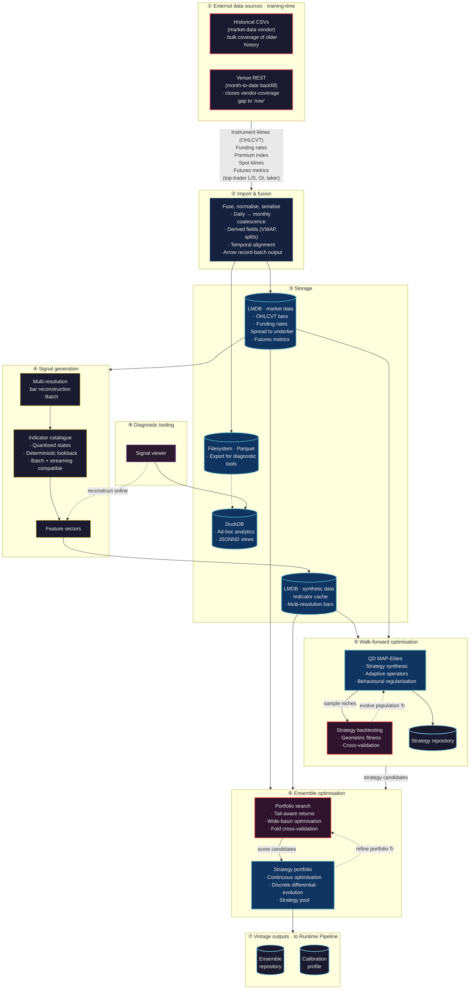

# Architecture of an autonomous evolutionary-learning trading platform

## Overview

Learning from data by evolving populations of trading strategies for linear markets. Rather than optimising a single strategy, the system maintains a diverse archive of behaviorally distinct strategies — each occupying a unique niche defined by what it does rather than how well it performs.

This quality-diversity approach ensures the system explores the full landscape of viable trading behaviors rather than converging prematurely on one style. A trend-following strategy that trades weekly and a mean-reversion scalper that trades hourly both survive in the archive simultaneously, even if the scalper currently has higher returns — because they represent fundamentally different market hypotheses that may perform differently under regime change.

The continuous-deployment result is the system's honest estimate of live-deployment performance.

## Architecture

The system combines three established research directions in evolutionary computation:

**Quality-Diversity Optimisation.** The strategy archive is structured so that behavioral diversity is maintained by construction. Strategies are classified along orthogonal dimensions with technical indicators driving decisions, risk profile, and position holding characteristics. Each behavioral niche holds a small sub-population of strategies providing robustness against the fitness noise inherent in financial time series evaluation.

**Adaptive Operator Selection.** Multiple variation operators (ranging from conservative local refinement to aggressive exploration to entirely fresh random generation) compete for computational budget. The system learns which operators are productive given the current state of the archive, favouring exploration when the archive is sparse and exploitation when niches are well-populated.

**Walk-Forward Validation.** Strategies are evolved on rolling training windows and validated on unseen data. The archive persists across window transitions: strategies that remain effective on new data continue to be selected as parents, while those that degrade are naturally displaced. This provides continuous adaptation to evolving market regimes without catastrophic forgetting.

## Scalability

Evolutionary search adopts an embarrassingly parallel approach that scales across available compute cores while preserving full behavioral diversity.

## Robustness

Strategy recording uses a phased lifecycle that distinguishes between early exploration (archive filling with mediocre first-pass discoveries) and later exploitation (archive refining within established niches). Only strategies that survive the exploitation phase and exceed a quality threshold derived from the full validation distribution are persisted. This prevents the system from recording early lucky candidates that would not have survived further competition.

Deployed ensembles run under layered circuit breakers — per-strategy, per-cohort (slow drawdown and fast drop), and ensemble-wide fast drop — with thresholds calibrated prior to deployment based on observed behaviour.

Downstream of strategy discovery, a separate portfolio construction stage assembles ensembles from the discovered strategies using risk-aware optimisation that accounts for tail risk and regime sensitivity. The evolutionary search has no visibility into portfolio-level outcomes — a strict information barrier that prevents look-ahead bias from contaminating the discovery process. The same firewall extends downstream: live execution observations cannot influence ensemble construction, and ensemble construction cannot influence the strategy archive.

## Theory

The approach builds on published work in quality-diversity optimisation (MAP-Elites, Mouret & Clune 2015; Deep Grid MAP-Elites, Flageat & Cully 2020), adaptive operator selection (multi-emitter MAP-Elites, Colas et al. 2020; CMA-MAE, Fontaine & Nikolaidis 2023), and Bayesian parent selection under uncertainty (Thompson Sampling). The application to financial strategy discovery and the concurrent execution model are novel contributions.

## Platform

The platform is composed of two distinct data flows, each serving a different operational purpose, interacting with different external dependencies, and targeting a different audience. The training pipeline performs offline evolutionary learning from historical state — ingest → fuse → features → evaluate → learn → optimise → calibrate — producing per-vintage chromosomes and ensembles. The runtime pipeline consumes training artefacts to operate a Hedge Planner, translating target positions into optimal hedge orders against an exchange venue. Aside from shared indicators and strategy logic, the two pipelines remain intentionally decoupled, with distinct data, computation, and storage characteristics.

### Training

The import and fusion stage is fed by two complementary ingress paths operating in parallel. Historical CSV datasets provide the bulk of long-range history — typically months to years of coverage — distributed according to the vendor’s release cadence, usually monthly and with an inherent publication lag. Venue REST endpoints provide a month-to-date backfill layer that closes the gap between the vendor’s latest published snapshot and the current trading date. Without this incremental top-up, the effective right edge of the training corpus would drift progressively behind the live venue between vendor releases, causing the snapshot pipeline to train against increasingly stale market conditions.

The venue REST dependency used here is the same physical surface consulted by Diagram B’s runtime pipeline for live position bootstrap and reconciliation. Although both pipelines depend on the same upstream venue APIs, they do so in different operational contexts and cadences.
Once normalised and persisted, the fused data is consumed by the batch signal-generation stage before feeding two downstream optimisation passes:

* Walk-Forward Optimisation — a Quality-Diversity MAP-Elites process maintaining per-direction archives and producing the Strategy repository.
* Ensemble Construction — a Discrete Differential Evolution process producing the Ensemble repository together with a per-vintage Calibration profile.

The ensemble repository is consumed downstream by Diagram B’s “① Vintage Inputs” subgraph

### Runtime

The runtime's external Binance dependencies — both data subscriptions and the order-submission endpoint — are gathered in subgraph ② **External venues**. The Hedge Planner and the Edge gateway read **disjoint sets** within it: the Hedge Planner consumes wss Market-tier streams (kline + markPrice@1s) and the full REST surface (klines, markPriceKlines, premiumIndexKlines, fundingRate, /futures/data/* metrics) to drive its evaluation pipeline and bootstrap; the Edge gateway consumes wss Realtime-tier streams (bookTicker + depth20) plus one Market-tier stream (aggTrade) for execution mechanics; and only the Edge gateway submits orders back to the venue. The two sides share no upstream data path even though they're grouped visually.

On startup, the **Bootstrap pipeline** pulls REST historicals and replays the lookback window through the same evaluator the live path will use, reconstructing per-strategy state to where a continuously-running Hedge Planner would currently hold it. The **Live pipeline** then takes over, driven by wss continuation against the same evaluator session — bootstrap and live share state, the handoff is in-process. Per-strategy decisions pass through a **Circuit-breaker layer** (strategy/direction/ensemble limits + slow/med/fast drawdown thresholds, calibrated from the per-vintage sidecar and driven by the equity stream including the smoothed-mark tick observer) that can clamp gated strategies to flat before netting; the resulting decisions are netted into a single aggregate target position and flow into the Hedge Planner → Venue adapter → Venue chain over gRPC. The Hedge Planner is **stateless with respect to current position** — a singular benefit of the target-position based architecture — emitting absolute targets that the Venue adapter (the **Position keeper**) translates into venue-native deltas against its kept position, consuming the live user-data stream (or simulator) of position reports and fills. Cash is held venue-side in live mode (the adapter's in-memory ledger is reserved for simulation); the Hedge Planner maintains an independent view of equity and available margin for capital allocation and surfaces it to the cockpit. No database sits on the order-execution critical path — position state reconstructs from venue position reports on every restart via the bootstrap pipeline.

A **PnL Attribution cold path** (subgraph ⑨) carries per-strategy realized PnL forward asynchronously. The **Strategy Allocation Journal** opens at Hedger start-up — its handshake runs in parallel with the position bootstrap and, if it fails, the operator is asked to confirm before the Hedger proceeds. Once running, every revision the Hedge Planner emits is queued for journal append on a best-effort, fire-and-forget basis; the append never gates the gRPC dispatch to the Edge gateway, and failed appends are retried in the background. The retry queue is time-bounded to 3 days — appends older than that are dropped, accepting bounded attribution-data loss in exchange for steady-state liability containment under a permanent journal outage. A separate **Reconciliation** process periodically joins the journal against the venue's REST trade history (a different surface than the order endpoint — `/userTrades`, `/income`, similar venue-historical endpoints) to reconstruct per-strategy realized PnL, fees, and funding for arbitrary backward windows. This sits outside the steady-state critical path by design — its purpose is post-hoc attribution that survives Hedge Planner restarts, reorgs, and the period before the in-memory observability stream was being captured.

Subgraph ① is Diagram A's outputs entering as read-only inputs at vintage load time; the dashed **Vintage rollover** edge from the Training Pipeline (Diagram A) node signals the periodic ensemble-rebalancing flow that replaces the contents of this subgraph in place. The **Signal Generation · Online** subgraph groups the two indicator-computation steps (bootstrap factor merge + live indicator pipeline) around the shared **Indicator Catalogue** — the same code module appearing in Diagram A's offline counterpart. Both the bootstrap and live data flows enter this subgraph for indicator computation and exit back to their respective pipelines, guaranteeing batch / streaming parity by construction. All wss + REST ingress paths within subgraph ② wire through a venue-aware rate-limit handler for REST and a tier-partitioned websocket connection registry for wss; the three subaccount-scoped private streams are not shown.

```mermaid
flowchart TB
    tp_src["Training pipeline<br/>(Diagram&nbsp;A)<br/>· Periodic rebalancing"]

    subgraph vinp["① Vintage inputs · from Training Pipeline"]
        direction TB
        repo[("Ensemble<br/>repository")]
        calib[("Calibration<br/>profile")]
    end

    subgraph ext_market["② Market observables"]
        direction LR
        wss_h_mkt["wss · Market tier<br/>· kline (5m / 30m / 4h)<br/>· markPrice@1s"]
        rest["REST api<br/>· klines + continuousKlines<br/>· markPriceKlines<br/>· premiumIndexKlines<br/>· fundingRate + fundingInfo<br/>· /futures/data/* — top-trader L/S, OI, taker<br/>endpoints"]
        wss_e_rt["wss · Realtime<br/>· bookTicker<br/>· depth20@100ms<br/>· aggTrade"]
    end
    
    subgraph shared_lib["Signal generation"]
        direction TB
        indicators_cat["Indicator catalogue<br/>· Quantised states<br/>· Deterministic lookback<br/>· Batch + streaming<br/>compatible"]
    end
 
    subgraph boot["③ Bootstrap pipeline · startup-only"]
        direction TB
        boot_fetch["REST fetchers<br/>(paginated + retried)"]
        boot_cache[("Ephemeral REST cache<br/>· Closed-window<br/>historical only")]
        boot_resolve["Multi-resolution<br/>bar reconstruction<br/>· Replay"]
        boot_merge["Factor merge<br/>+ markPrice replay (1-min cadence)"]
        boot_replay["Evaluator session · replay mode<br/>· Bar evaluation on close<br/>· Tick observer on mark close<br/>(slow-DD probe)"]
        boot_state["Reconstructed state<br/>· Per-strategy positions<br/>· Dormancy latches<br/>· Committed peak equity"]
        boot_fetch -.->|"read-through<br/>+ write-back"| boot_cache
        boot_fetch --> boot_resolve
        boot_merge --> boot_replay --> boot_state
    end

    subgraph obs["⑦ Observability"]
        direction LR
        cockpit["Cockpit<br/>· Per-strategy state and position<br/>· Circuit breaker status<br/>· Position + equity + system health<br/>· Manual controls"]
    end
    
    subgraph live["④ Live pipeline · steady-state"]
        direction TB
        live_kline["Live kline source<br/>(REST prime + wss stitch)"]
        live_resolve["Multi-resolution<br/>bar reconstruction<br/>· Streaming"]
        live_pipe["Factor join<br/>(factor row)"]
        live_session["Evaluator session · live mode<br/>· Bar evaluation on close<br/>· Tick observer on smoothed mark"]
        live_mark["Mark EMA loop<br/>τ½ = 60s on markPrice@1s"]
        live_breakers["Circuit breakers<br/>· strategy / direction / ensemble limits<br/>· slow / med / fast drawdown thresholds"]
        live_netter["Position netting<br/>(per-bar evaluation)"]
        live_kline --> live_resolve
        live_pipe --> live_session
        live_mark --> live_session
        live_session --> live_breakers --> live_netter
    end

    subgraph executor_proc["⑥ Edge gateway"]
        direction TB
        router["Venue adapter<br/>· Translate to native capabilities<br/>· Position keeper<br/>· Track order lifecycle<br/>· Colocated<br/>"]
    end
    
    subgraph hedger_proc["⑤ Hedge Planning"]
        direction TB
        hedger["Target Position Hedger<br/>· Emits instructions<br/>· Track equity, buying power<br/>"]
    end

    subgraph ext_venues["⑧ Order execution facility"]
        venue["Venue<br/>(order endpoint)"]
    end

    subgraph cold["⑨ PnL Attribution · cold path"]
        direction TB
        journal[("Strategy Allocation [WIP]<br/>Journal<br/>· Revision emissions<br/>· Strategy-contribution<br/>snapshots")]
        reconcile["Reconciliation<br/>· Join journal × venue fills"]
        attrib_out[("Attribution outputs<br/>· PnL decomposition<br/>· Modeled-vs-realised")]
        journal --> reconcile
        reconcile --> attrib_out
    end

%% External dependencies → pipelines
    rest --> boot_fetch
    wss_h_mkt --> live_kline
    wss_h_mkt --> live_mark
    wss_e_rt --> router

%% Vintage inputs → both pipelines (read-only at startup)
%%    repo --> boot_replay
%%    repo --> live_session
%%    calib --> boot_replay
    vinp --> boot
%%    calib --> live_session
    vinp --> live

%% Periodic vintage rollover (from Diagram A) — the dashed edge from
%% the Training Pipeline node signals the in-place replacement of repo +
%% calibration profile when the Training Pipeline emits a new ensemble.
    tp_src -.->|"Vintage rollover"| vinp


%% Bar reconstruction → indicator catalogue (decoration) → factor merge / join
    boot_resolve --> shared_lib
    live_resolve --> shared_lib
    shared_lib --> boot_merge
    shared_lib --> live_pipe

%% Bootstrap → live cutover
    boot_state -.->|"in-process handoff at cutover"| live_session

%% Live → execution chain
    live_netter --> hedger
    hedger -->|"gRPC"| router

%% Edge gateway ↔ External venue (both arrows point ext_venues-ward
%% to give dagre a pure DAG — no cycle means ext_venues lands
%% deterministically below executor_proc. The dashed return-path
%% edge is oriented as a subscription relationship rather than a
%% data-flow direction; data still moves venue → venue adapter.)
    router -->|"place venue-native order"| ext_venues
    router -.->|"subscribes to<br/>user-data stream<br/>(fills + positions + heartbeat)"| ext_venues
    router -->|"fills +<br/>position reports"| hedger
    router -.->|"heartbeat +<br/>venue health"| hedger

%% Reconciliation reads venue trade history out-of-band — a different
%% physical surface than the order endpoint (userTrades / income).
    reconcile -.->|"REST · trade history<br/>(post-hoc, periodic)"| ext_venues

%% Cold-path PnL attribution — async, off the critical path
%% Hedger emissions queue a journal append on best-effort fire-and-forget
%% basis; the append does not gate the gRPC dispatch above. Failed appends
%% retry in the background for up to 3 days, then drop. The startup
%% handshake runs in parallel with the bootstrap and gates only on
%% explicit operator confirmation if it fails. Dashed = non-blocking.
    hedger -.->|"best-effort append<br/>(non-blocking, retried)"| journal

%% Cockpit dashed inputs (all in-process reads from Hedge Planner / breaker layer)
    hedger -.->|"equity + positions + health"| obs
    live -.-> obs

%% Styling — palette matches Diagram A
    classDef extstyle fill:#1a1a2e,stroke:#e94560,color:#eee,stroke-width:2px
    classDef vintageStyle fill:#0f3460,stroke:#53a8b6,color:#eee,stroke-width:2px
    classDef signalStyle fill:#1b1b2f,stroke:#e2b714,color:#eee,stroke-width:1px
    classDef bootStyle fill:#2c1b2f,stroke:#b366e0,color:#eee,stroke-width:1px
    classDef liveStyle fill:#1b2f1b,stroke:#4caf50,color:#eee,stroke-width:1px
    classDef execStyle fill:#2d132c,stroke:#ee4540,color:#eee,stroke-width:2px
    classDef obsStyle fill:#1b1b2f,stroke:#e2b714,color:#eee,stroke-width:1px
    %% Cold-path nodes: dashed-storage signals off-critical-path / async
    classDef coldStore fill:#0f3460,stroke:#7a89c2,stroke-width:2px,stroke-dasharray: 4 3,color:#eee
    classDef coldEngine fill:#1b1f2f,stroke:#7a89c2,stroke-width:1px,color:#eee
    classDef artefact fill:#1a1a2e,stroke:#7ec8e3,color:#eee,stroke-width:2px

    class wss_h_mkt,wss_e_rt,wss_e_mkt,rest,venue extstyle
    class repo,calib artefact
    class indicators_cat signalStyle
    class boot_cache,boot_fetch,boot_resolve,boot_merge,boot_replay,boot_state bootStyle
    class live_kline,live_resolve,live_pipe,live_session,live_mark,live_breakers,live_netter liveStyle
    class hedger,edge,router execStyle
    class cockpit obsStyle
    class journal,attrib_out coldStore
    class reconcile coldEngine
```

#### Notes on the runtime diagram

- **The same <code>evaluator session</code> runs through Bootstrap and Live.** Bootstrap drives it from REST historicals (replay mode); at cutover it switches in place to wss continuation (live mode). No new object, no state copy.
- **Bootstrap → Live cutover** — the connection between the pipelines communicates the temporal handoff when replay finishes and live takes over.
- **`venue → Venue adapter` feedback path.** Fills and position reports originate at the venue, arrive at the Venue adapter via the live user-data stream or simulator, and are absorbed into the Position keeper. Downstream consumers — the Hedge Planner (for its equity + available margin view), the evaluator session (stateless position model), the reconciliation bridge — read from the keeper in-process; those wires are not shown to avoid edge clutter. The position-report stream is treated as authoritative ground truth: the system never *infers* its own position; it reads venue reports.
- **Stateless critical path** — no database participates in the order-execution loop. Position state reconstructs on every restart (cold-start by bootstrap; steady-state via the feedback path above). The only persistence touched on the emission path is the **Strategy Allocation Journal** append (subgraph ⑨), which is fire-and-forget with 3-day time-bounded background retry and never gates the gRPC dispatch downstream. The journal's start-up handshake runs in parallel with the bootstrap; only handshake failure (not steady-state append failure) requires operator confirmation before the Hedger proceeds.
- **Cold-path PnL attribution** (subgraph ⑨) reconstructs per-strategy realised PnL, fees, and funding by joining the journal against venue trade history. It is the durable counterpart to the live cockpit's in-memory attribution view: the cold path survives restarts and supports backward windows of arbitrary length for modeled-vs-realised audits, post-trade analytics, and operator reporting.
- **The cockpit is the operator surface** — primarily observability (dashed inputs) with manual controls (pause hedging, override target-position) that are not on the steady-state critical path.
- **The ephemeral REST cache** sits below the rate-limit handler in the HttpClient stack, between the bootstrap fetchers and the venue. Closed-window historical responses are deemed immutable.